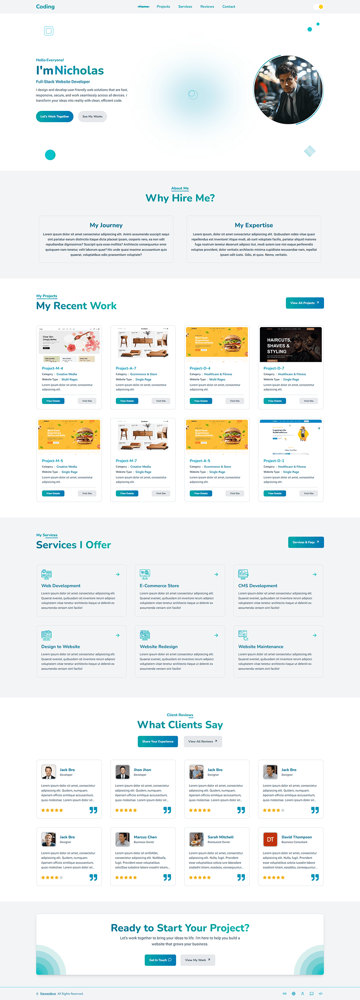

  <h1>Web Client Next.js Portfolio</h1>

  

    <strong>About the Project:</strong>
    A professional portfolio website built for a freelance web developer. It showcases projects with live preview, a services section, a client reviews system, and a contact form — all in a clean, responsive design with dark mode support.
  

  

    <strong>Key Highlights:</strong>
    Features Clerk authentication, MongoDB-backed reviews, live website preview inside a modal, category and search filters, and smooth Swiper sliders — all built with Next.js 16 and Tailwind CSS v4.
  

  

    <strong>Explore the project:</strong>
    Visit the <a href="https://web-client-nawazdevx.vercel.app/" target="_blank">Live Website</a>
    or watch the <a href="https://nawazdevx.vercel.app/projects" target="_blank">Demo Video</a>.
  

<h2>Project Details</h2>

<h4>What's Inside</h4>

<ul>
  <li><strong>Home Section</strong> — Hero, about, projects, services, reviews, and CTA</li>
  <li><strong>Projects Page</strong> — Filterable grid with search, category, and pagination</li>
  <li><strong>Project Detail Page</strong> — Full project info with live preview modal</li>
  <li><strong>Services Page</strong> — Services list with FAQ section and slider layout</li>
  <li><strong>Reviews Page</strong> — All client reviews with submit and edit support</li>
  <li><strong>Contact Page</strong> — Contact form connected to Resend email API</li>
  <li><strong>Feedback Page</strong> — Public page for sharing a review experience</li>
  <li><strong>Site Header</strong> — Sticky navigation with theme toggle and links</li>
  <li><strong>Site Footer</strong> — Footer with social links and site info</li>
</ul>

<h4>Key Features</h4>

<ul>
  <li><strong>Clerk Authentication</strong> — Users sign in to submit or edit their review</li>
  <li><strong>Live Preview Modal</strong> — Opens any project website inside a responsive iframe modal</li>
  <li><strong>Device Preview Switcher</strong> — Toggle preview between mobile, tablet, laptop, and desktop views</li>
  <li><strong>Project Filters</strong> — Search by keyword, filter by category and subcategory</li>
  <li><strong>MongoDB Reviews</strong> — Users can submit, edit, and view reviews stored in the database</li>
  <li><strong>Resend Email API</strong> — Contact form sends emails directly using Resend</li>
  <li><strong>Dark Mode</strong> — Full dark and light theme with system preference support</li>
  <li><strong>Swiper Sliders</strong> — Autoplay sliders for projects, services, and reviews on smaller screens</li>
  <li><strong>Pagination</strong> — Projects page uses client-side pagination with smooth scroll</li>
  <li><strong>SEO Metadata</strong> — Full Open Graph, Twitter Card, and robots metadata configured</li>
  <li><strong>Skeleton Loaders</strong> — Smooth loading state for projects and reviews sections</li>
  <li><strong>Responsive Design</strong> — Fully responsive layout across all screen sizes</li>
</ul>

<h4>Technologies Used</h4>

<ul>
  <li><strong>Next.js 16</strong> — React framework with App Router and server-side API routes</li>
  <li><strong>React 19</strong> — UI component library for building interactive interfaces</li>
  <li><strong>Tailwind CSS v4</strong> — Utility-first CSS framework for fast, responsive styling</li>
  <li><strong>Clerk</strong> — Authentication provider for secure sign-in and user management</li>
  <li><strong>MongoDB & Mongoose</strong> — Database for storing and managing user-submitted reviews</li>
  <li><strong>Resend</strong> — Email API used to handle contact form submissions</li>
  <li><strong>Swiper.js</strong> — Touch-friendly slider for projects, services, and review carousels</li>
  <li><strong>React Paginate</strong> — Pagination component for the projects listing page</li>
  <li><strong>Lucide React</strong> — Clean and consistent icon library used across the UI</li>
  <li><strong>React Icons</strong> — Additional icons used in navigation and UI elements</li>
  <li><strong>Sonner</strong> — Lightweight toast notification library for user feedback</li>
  <li><strong>Vercel</strong> — Deployment platform for hosting the Next.js application</li>
</ul>

<h4>Project Structure</h4>

<pre>
web-client-nextjs-portfolio/
│
├── public/
│   ├── projects/images ...         # Project screenshot images
│   ├── services/images ...         # Service section images
│   └── logo, profile-pic, assets  # Static site assets
│
├── src/
│   ├── app/
│   │   ├── api/
│   │   │   ├── contact/route.js          # Contact form email API using Resend
│   │   │   └── reviews/
│   │   │       ├── route.js              # GET all reviews, POST new review
│   │   │       └── [id]/route.js         # GET and PUT user's own review
│   │   │
│   │   ├── contact/page.jsx              # Contact page
│   │   ├── feedback/page.jsx             # Public feedback/review page
│   │   ├── projects/
│   │   │   ├── page.jsx                  # All projects with filters and pagination
│   │   │   └── [id]/page.jsx             # Single project detail page
│   │   ├── reviews/page.jsx              # All reviews page
│   │   ├── services/page.jsx             # Services and FAQ page
│   │   ├── layout.jsx                    # Root layout with Clerk, fonts, and metadata
│   │   ├── page.jsx                      # Home page
│   │   ├── not-found.jsx                 # Custom 404 page
│   │   ├── globals.css                   # Global styles and Tailwind configuration
│   │   └── utilities.css                 # Reusable utility CSS classes
│   │
│   ├── components/
│   │   ├── contact/
│   │   │   └── MainPage.jsx              # Contact form UI component
│   │   │
│   │   ├── projects/
│   │   │   ├── Card.jsx                  # Project card and skeleton card component
│   │   │   ├── Featured.jsx              # Featured projects slider and grid
│   │   │   ├── LivePreview.jsx           # Live preview modal with device switcher
│   │   │   ├── MainPage.jsx              # Projects page with search, filter, pagination
│   │   │   └── SmallUI.jsx               # Small reusable UI for projects
│   │   │
│   │   ├── reviews/
│   │   │   ├── Card.jsx                  # Review card component
│   │   │   ├── Form.jsx                  # Review submission and edit form
│   │   │   ├── MainPage.jsx              # Reviews page layout
│   │   │   ├── SliderGrid.jsx            # Reviews slider and grid layout
│   │   │   └── SmallUI.jsx               # Small reusable UI for reviews
│   │   │
│   │   ├── services/
│   │   │   ├── Card.jsx                  # Service card component
│   │   │   ├── MainPage.jsx              # Services page layout
│   │   │   ├── SliderGrid.jsx            # Services slider and grid layout
│   │   │   └── SmallUI.jsx               # Small reusable UI for services
│   │   │
│   │   ├── ui/
│   │   │   ├── BgEffects.jsx             # Background glow and decorative effects
│   │   │   ├── Button.jsx                # Reusable button component
│   │   │   └── Preloader.jsx             # Page preloader animation
│   │   │
│   │   ├── SiteFooter.jsx                # Site footer with links and info
│   │   ├── SiteHeader.jsx                # Sticky header with navigation and theme toggle
│   │   └── SiteLayout.jsx                # Layout wrapper with header and footer
│   │
│   ├── data/
│   │   ├── projects/
│   │   │   ├── business.json             # Business category project data
│   │   │   ├── community.json            # Community category project data
│   │   │   └── creative.json             # Creative category project data
│   │   ├── reviews.json                  # Default reviews shown as fallback
│   │   └── services.json                 # Services and FAQ data
│   │
│   ├── hooks/
│   │   ├── providers.js                  # App-level providers setup
│   │   ├── useProjects.js                # Project filtering, pagination, and caching logic
│   │   ├── useReviews.js                 # Review fetching and submission logic
│   │   ├── useTheme.jsx                  # Dark and light mode toggle hook
│   │   └── useTouch.js                   # Mobile touch event detection hook
│   │
│   ├── lib/
│   │   ├── db.js                         # MongoDB connection setup
│   │   └── validations.js               # Review data validation helpers
│   │
│   ├── models/
│   │   ├── Contact.js                    # Contact form Mongoose model
│   │   └── Review.js                     # Review Mongoose model with userId unique index
│   │
│   └── middleware.js                     # Clerk auth middleware for protected routes
│
├── .env.local                            # Environment variables (not committed)
├── .gitignore                            # Git ignored files
├── eslint.config.mjs                     # ESLint configuration
├── jsconfig.json                         # JS path aliases configuration
├── next.config.mjs                       # Next.js configuration
├── postcss.config.mjs                    # PostCSS configuration for Tailwind
├── package.json                          # Project dependencies and scripts
└── package-lock.json                     # Dependency lock file
</pre>

<h4>Quick Start</h4>

<ol>
<li>
<strong>Clone the repository:</strong>
<pre><code>git clone https://github.com/nawazdevx/web-client-nextjs-portfolio.git</code></pre>
</li>

<li>
<strong>Set up environment variables:</strong>

Create a <code>.env.local</code> file in the <strong>root directory</strong> and add the following variables:

<pre><code>MONGODB_URI=your_mongodb_connection_string

NEXT_PUBLIC_CLERK_PUBLISHABLE_KEY=your_clerk_publishable_key
CLERK_SECRET_KEY=your_clerk_secret_key

RESEND_API_KEY=your_resend_api_key
RESEND_FROM_EMAIL=your_verified_sender_email
CONTACT_EMAIL=your_inbox_email

NEXT_PUBLIC_BASE_URL=http://localhost:3000

NODE_ENV=development
</code></pre>
</li>

<li>
<strong>Install dependencies and start the development server:</strong>
<pre><code>npm install
npm run dev</code></pre>
Then visit <code>http://localhost:3000</code>
</li>

<li>
<strong>Start Customizing:</strong>
<ul>
  <li>Update your name, title, and bio text in <code>src/app/page.jsx</code></li>
  <li>Add your projects data in <code>src/data/projects/</code> JSON files</li>
  <li>Update your services and FAQ content in <code>src/data/services.json</code></li>
  <li>Replace the profile picture and logo in the <code>public/</code> folder</li>
  <li>Update site metadata and SEO details in <code>src/app/layout.jsx</code></li>
</ul>
</li>
</ol>

 

  <strong>License:</strong>
  This project is licensed under the <a href="https://choosealicense.com/licenses/mit/">MIT License</a>.

  <strong>Contact:</strong>
  Connect with me on <a href="https://www.linkedin.com/in/nawazdevx">LinkedIn</a>
  or visit my <a href="https://nawazdevx.vercel.app/">Portfolio</a>.

  <strong>Support:</strong>
  Found this helpful? Give it a ⭐ on GitHub! Thank you.

 

  <h2>Project Preview</h2>
  

